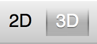
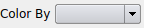
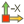
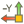

.. index:: Toolbars

Default Toolbar Buttons
=======================

ModelBuilder by default starts with four toolbars open: File IO, Camera Controls, Selection, and Color.

File IO
^^^^^^^
|pqOpen32| Open a file.

.. Note::
	to open a file, a :ref:`plugin <load-plugins>` with the appropriate reader must be loaded

Camera Controls
^^^^^^^^^^^^^^^

|pqResetCamera32| Reset the camera to the default view

|pqXMinus24| |pqXPlus24| |pqYMinus24| |pqYPlus24| |pqZMinus24| |pqZPlus24| Change the camera to the respective axis

|pqZoomToBox24| Zoom the camera view to a user-selected box

|pqZoomToSelection24| Zoom the camera view to a user-selected box and select the elements within the box

|pqShowCenterAxes24| Show a 3D orientation indicator of the camera's center

|pqResetCenter24| Reset the camera center to the default

|pqPickCenter24| Allow the user to manually click and define a camera center

|LinkCenterAndFocal| Make future manipulations of the camera view rotate around the current camera center.

|CameraManipulationStyle| Toggle between 2D and 3D camera manipulation

Selection
^^^^^^^^^

|pqSelect32| Allow the user to select an objects and faces with a box

Color
^^^^^

|ColorBy| Color each {entity, group, volume, attribute} with a unique color

|pqScalarBar24| Show a legend of every item and its corresponding color

.. |pqScalarBar24| image:: images/pqScalarBar24.png
.. |pqSelect32| image:: images/pqSelect32.png
	:scale: 75%

.. |pqZoomToBox24| image:: images/pqZoomToBox24.png

