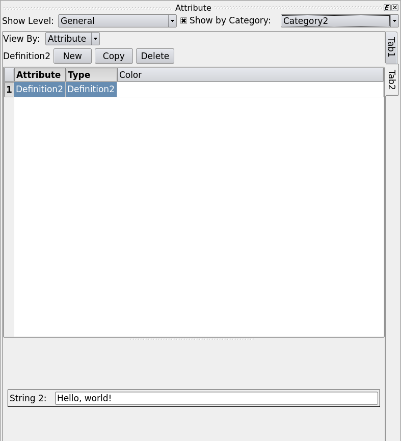

Getting Started
===============
This section aims to present the basic operations in ModelBuilder and familiarize
the user with the logic of ModelBuilder using the following examples:
`test2D.cmb <https://gitlab.kitware.com/cmb/cmb-testing-data/blob/master/model/2d/cmb/>`_
and :download:`sample.crf <samples/sample.crf>`.

When opening ModelBuilder, the window will look similar to the figure below:

.. findfigure:: DefaultScreen.*
	:align: center

Managing Plugins
----------------
In order to load a model, a correct plugin must be loaded. Clicking Tools -
Mange Plugins:

.. findfigure:: LoadPluginsStep1.*

a plugin manager will be shown like this:

.. findfigure:: LoadPluginsStep2.*

The plugins come with CMB are located in the "install/lib" directory of the
cmb-superbuild. To load a new plugin, click “Load New...” and browse for a
plugin. The plugins will show up in the “Local Plugins” list after being loaded
with a “Loaded” Property. In our case, the smtkDiscreteSessionPlugin needed by
test2D.cmb has already been loaded by default.

Importing Model
---------------
Now that the correct plugin is loaded, we can import the model.

.. _load-plugins:
.. index:: Loading Plugins

.. findfigure:: ImportObjectsStep1.*
	:align: right
	:scale: 60%

To import an object, click on the “Open” |pqOpen32| icon in the File IO toolbar
or go to File—Open (CTRL-O) in the main menubar.

In case there are too many files in the directory, click on "Files of type" to
select a certain type of file to make the target easier to find. Notice the file
types shown here depend on the loaded plugins.

Browse and open the test2D.cmb file.

To unload all models currently in the scene, click “File—Close Data” (CTRL-W).

Window Layout
-------------
At this point, you should see a window like below:

.. findfigure:: WindowLayout.*

The upper portion of the window is the tool bar which allows you to operate on the
files and views, as well as the settings, tools and help.

The right middle portion of the window is menu tab which controls the model details
including the geometry, mesh, visualization, and so on.

The left middle portion of the window shows the model. You can use the mouse to manipulate
the camera view, and pick individual model entities.

The lower portion of the window is the log window, which displays the logs
generated by the smtk server. It gives the user hints when something goes wrong.

Viewport Interaction
--------------------
.. index:: Camera Manipulation

Camera Manipulation
```````````````````
To rotate the current view, middle-click and drag on the viewport.

To pan the current view, left-click and drag on the viewport.

To zoom the current view, right-click and drag on the viewport (or use the scrollwheel).

Camera Adjustments
``````````````````
For precise camera adjustments, click “View—Camera—Adjust Camera” to bring up the “Adjust Camera” window.

From this window exact numerical values of the camera properties can be entered.

Custom views can be configured here. Configurations can be loaded and saved here.

Model Interaction
-----------------
There are two major methods to interact with the model entities. One way is to
pick them in the entity tree under "Model" tab; the other way is to use
"Select Object" |pqSelect32| in the viewport.

.. seealso::
	:ref:`Selection <toolbars>` for the various filters available in ModelBuilder
	to facilitate the viewport selection.

Right-clicking on a face in the viewport will select the face and
bring up a context menu. From this menu, you can hide face, change color, and
change representation (of the object).

.. findfigure:: ModelFaceRightClick.*
	:scale: 60%

Attributes
----------
To load attributes, click the "Open" |pqOpen32| button on the File IO toolbar
and browse for the sample.crf linked above.
Switch to the Attribute tab. Your program should look similar to the figure below.

.. findfigure:: GettingStartedStateLoadedAttributes.*
	:align: center

The attribute view is customized by the template file, so different templates
do not necessarily have the same content. "Show Level" allows the user to present
the information at different levels: in this example "General" and "Advanced" are
used. Attributes can also be grouped into categories so that they can be displayed
by category when too many attributes are present. In this example, the input
parameter in Tab 2 is a "Double 2" under Category 1 and becomes a "String 2"
under Category 2.

|AttributeCategory1| |AttributeCategory2|

Two vertical tabs (Tab 1 and Tab 2) are shown on the right-hand side as examples
of the different sections of the simulation inputs, as shown below:

|AttributeTab1| |AttributeTab2|

Both Tab 1 and Tab 2 are designed to input certain parameters. But Tab 2 has a
table which allows you to insert multiple instances while Tab 1 does not. These
are due to the different types used in their views (coded in sample.crf).

Select File-Save Simulation to save attributes as a CRF file. To export the
attributes as simulation inputs, click on File-Export Simulation Files, the
export interface designed in the template that contains two analysis will be shown:

.. findfigure:: AttributeExport.*

.. Note::
	To export a simulation inputs deck, a Python script is required. For a
	user-created template, it has to be written by the user too. For the templates
	that come with ModelBuilder, the Python scripts are provided.

Finally, clicking File-Close Data or press CTRL-W to close the template after
saving it.


.. |pqSelect32| image:: images/pqSelect32.png



