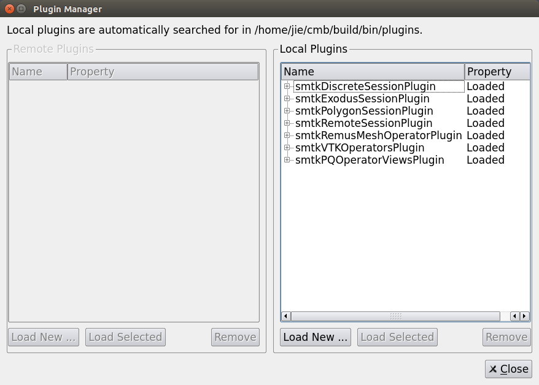

Getting Started
===============

When opening ModelBuilder, the window will look similar to the figure below.

.. findfigure:: DefaultScreen.*
	:align: center

This page will walk through some of the basic functions of ModelBuilder.

For more information of the simulation/attribute system, refer to the `SMTK <http://smtk.rtfd.org>`_ documentation.

For this page, we will be using the following files:

+------------+---------------+
| Filename   | Download Link |
+============+===============+
| test2D.cmb | test2D_       |
+------------+---------------+
| sample.crf | samplecrf_    |
+------------+---------------+

.. _test2D: https://gitlab.kitware.com/cmb/cmb-testing-data/blob/master/2D-CMBModels/test2D.cmb
.. _samplecrf: https://gitlab.kitware.com/snippets/3

The DiscreteSessionPlugin is also required.
This is library file is created during the compilation of the cmb-superbuild in the "install/lib" directory (linux users: in the x86_64-linux-gnu folder)

Importing Objects
-----------------

Before loading any objects, a plugin must be loaded with the correct reader.

.. _load-plugins:
.. index:: Loading Plugins

Loading Objects
^^^^^^^^^^^^^^^^^

.. findfigure:: ImportObjectsStep1.*
	:align: right

To import an object, click on the “Open” |pqOpen32| icon in the File IO toolbar or go to File—Open (CTRL-O) in the main menubar.
Browse and open the test2D.cmb file.

.. |pqOpen32| image:: images/pqOpen32.png

To unload all models currently in the scene, click “File—Close Data” (CTRL-W).

.. Note::
	The file extensions shown in the "File of Type:" filter in the file-open dialog are dependent on the loaded plugins

Viewport Interaction
--------------------

The test2D.cmb model should be visible in the scene view now.

.. index:: Camera Manipulation

Camera Manipulation
^^^^^^^^^^^^^^^^^^^

To rotate the current view, left-click and drag on the viewport.

To pan the current view, middle-click and drag on the viewport.

To zoom the current view, right-click and drag on the viewport (or use the scrollwheel).

Camera Adjustments
""""""""""""""""""

For precise camera adjustments, click “View—Camera—Adjust Camera” to bring up the “Adjust Camera” window.

From this window exact numerical values of the camera properties can be entered.

Custom views can be configured here. Configurations can be loaded and saved here.

Interacting with the Model
^^^^^^^^^^^^^^^^^^^^^^^^^^^

Right-clicking on a face within the viewport will select the face and bring up a context menu. From this menu, you can hide faces, change color, and change representation (of the object).

.. findfigure:: ModelFaceRightClick.*

Attributes
----------

.. seealso:: :ref:`The Attribute Tab <attribute-tab>`

To load attributes, click the "Open" |pqOpen32| button on the File IO toolbar and browse for the sample.crf linked above.
Switch to the Attribute tab. Your program should look similar to the figure below.

.. findfigure:: GettingStartedStateLoadedAttributes.*
	:align: center

Select File-Save Simulation and to save attributes as a CRF file.

Now, selecting "Close Data" (File-Close Data or CTRL-W) and reopening the saved CRF should reimport all the attribute changes made.

.. todo::
	Explore some more options

Loading Plugins
^^^^^^^^^^^^^^^

From the Tools menu at the top menubar, select “Manage Plugins...”

.. findfigure:: LoadPluginsStep1.*

Click “Load New...” and browse for a plugin (libsmtkDiscreteSessionPlugin).
The plugins will show up in the “Local Plugins” list after being loaded with a “Loaded” Property.

+-----------------------------------------+
| |LoadPluginsStep2| | |LoadPluginsStep3| |
+-----------------------------------------+

.. |LoadPluginsStep3| image:: images/LoadPluginsStep3.png
	:width: 250px

