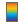

.. index:: polygon-session

.. _polygon-session:

Polygon Session
===============
We begin our introduction to sessions with the simplest one - the *polygon session*.
The *polygon session* is backed by Boost.polygon which is only available in 2D.
It is named "polygon session" because the geometry is limited to combinations
of polygons. This is currently the only session that allows the user to create
a model in ModelBuilder instead of importing it (File - New polygon model).
Next we introduce some features of this session.

.. Note::
	The features of introduced do not have to be exclusive. Some of them
	are shared by multiple sessions.

Model Operations
----------------
A model will be automatically created when the *polygon session* starts.
Right-click on the entity tree to create, close and save a model. Multiple models
can be grouped by clicking Model - Create Group. Right-click on the model in the
entity tree, select Model - Export edges to VTK, a window similar to this figure
will pop out:

.. findfigure:: PolySessionExportEdges.*
  :align: right
  :scale: 75%

Select the target model, fill out the filename and hit apply, the edges will be
exported to VTK.

Auxiliary geometry can be added to a model if necessary. Auxiliary geometry is a
file that contains additional information which can be visualized on the model
(for instance temperature data), or simply used as a background.
A variety of data formats can be used as auxiliary geometry including .tif,
.tiff, .dem, .vti, .vtp, .vtu, .vtm, .obj, .pts, .xyz.
"Add an image" is a similar option to load auxiliary geometry except
that it only accepts .tif, .tiff, .dem and .vti files. We will talk more about
adding auxiliary geometry in :ref:`The Discrete Session <discrete-session>`

Entities can be deleted by clicking Model Entities - Delete. Sometimes it is
convenient to color the model entities so that they look more distinct to each
other. This can be done with :ref:`Model Entities - Assign Colors <assign-colors>`.

Vertex Operations
-----------------
Vertices can be added using exact coordinates through "Vertex - Create" and
removed through "Vertex - Demote".

Edge Operations
---------------
Edges can be created interactively:

.. findfigure:: PolySessionEdgeCreate.*
  :align: right
  :scale: 75%

Click on Edge - Create Interactively, select the model you want to create edges
for in the polygon session window:

Next you can left-click in the viewport to create a vertex. A poly-linear line
will be generated following the vertices created. You can click on
"Close Contour" to connect the first and last vertices. Hit "Apply" to commit
the changes.

If you want to create an edge with exact coordinates, use Edge - Create from
Points. A tabular will be available to enter point coordinates. If vertices are
already created, you can form edges through them by using Edge - Create from
Vertices. If we have auxiliary geometry imported, we can even create edge from
the contours. See :ref:`The Discrete Session <discrete-session>` for more
instructions.

An edge can be reshaped using "Edge - Reshape". To do so, right-click on the
model tree and select "Edge - Reshape". Then click on "select edge to edit" and
box-select an edge, then drag the vertices on the screen or type in the
coordinates in "Advanced" mode.

.. findfigure:: PolySessionEdgeReshape.*
  :scale: 75%

Similarly to reshape, an edge can be split interactively with a vertex through
"Edge - Split". As shown in the figure below, a closed edge is split into two:

.. findfigure:: PolySessionEdgeSplit.*
  :scale: 75%

.. Note::
  "Edge - Reshape" and "Edge - Split" can only be performed on edges with more
  than 2 vertices.

Face Operations
---------------

Faces are created from edges. "Create from Edges" allow the user to create a
face from the selected edges while "Create All" will create multiple from all
the closed edges in a model.

.. findfigure:: PolySessionFaceCreate.*
  :scale: 75%

Mesh Operations
---------------

If a mesh is created or loaded, it will also be shown in the model tree. Mesh
can be deleted, saved or exported. However, currently ModelBuilder is unable
to generate mesh, you must have an external mesher to do that.

.. seealso::
  `The Mesh Tab
  <http://cmb.readthedocs.io/en/latest/ModelBuilder/The%20Mesh%20Tab.html>`_ for
  using external mesher with ModelBuilder.

Another interesting operation available for mesh is interpolation, which creates
a field variable either on cell fields or point fields. Right-click on Mesh -
interpolate:

.. findfigure:: PolySessionMeshInterpolate.*
  :align: right
  :scale: 60%

First you need to select a mesh to interpolate on, then specify a field name.
After choose an output field type, you can create interpolation points where
you assign the values of the field variable. In this example, two interpolation
points are created, ranging from 0 to 1. The interpolation is done with
`Shepard's method <https://en.wikipedia.org/wiki/Inverse_distance_weighting>`_
and the "power" entry specifies the weighting power. Hit "Apply" the field
variable will be interpolated on the whole mesh.

You may want to visualize the field variable. To do so, go to Display tab,
choose the field variable in Coloring. You can also click on |pqScalarBar24|
to bring up the legend bar.

.. findfigure:: PolySessionMeshInterpolate2.*
  :align: center
  :scale: 75%

Bathymetry can be applied to mesh through Mesh - Apply Bathymetry. We save
this feature for :ref:`The Discrete Session <discrete-session>` as well.

