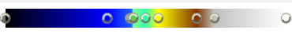
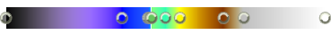

.. index:: Color Map Tab

The Color Map Tab
=================

.. findfigure:: DisplayColoring.*
	:align: right

This tab is used for rendering settings. It is populated only if the "Coloring" under "Display" tab is filled (the model is colored by some variable)

Lock Data Range—enable when you do not want automatically adjust data with the filters

Interpret Values As Categories—switch the color functions to categorical colors mode

Rescale On Visibility Change—adjust the color map with the model visibility

Mapping Data
------------
This section exists only if “Interpret Values As Categories” is not selected

The main colorbar is scaled from 0 to 1, where element values will use the corresponding values on the colorbar for determining color.

.. findfigure:: ColormapBar.*
	:align: right

To add a point, left-click on the color bar.

Click and drag any point to move its location. Values can also be inputted into the “Data” field below the colorbar.

To edit the color of a point, double-click it.

To remove a point, middle-click it.

There are various options to the right of the colorbar including:

To scale to the colorbar's minimum and maximum values to the min/max of your dataset, click the “Rescale to data range” button. A custom range can also be specified by clicking the “Rescale to custom range” button

For data with multiple timesteps, the min/max range can be set the the dataset's entire min/max range by clicking the “Rescale to data range over all timesteps” button

Common color bar maps are available to use by clicking the “Choose preset” button. The current color map can be saved as a preset by clicking the “Save to preset” button

Clicking the “Manually edit transfer functions” button adds a new table below the colorbar. This table shows all the points in the colorbar and their corresponding values in RGB

For datasets derived from a logarithmic distribution, selecting “Use log scale when mapping data to colors” may give a better visual of color progression

Alpha values can be mapped onto elements as well if “Enable opacity mapping for surfaces” is checked

If values are being changed, the color map can dynamically update if “Automatically rescale color map range to fit data” is checked

Here is an example of the mapping data of the evaluation of the chesapeake bay

.. findfigure:: ColorMapExample.*
  :scale: 75%

Color Mapping Parameters
------------------------

Color Space—The color space {RGB, HSV, Lab, Diverging} that the color values are mapped from. Notice how modifying color space changes the color map

RGB |ColorSpaceRGB|

Diverging |ColorSpaceDiverging|

Use Below Range Color/Use Above Range Color—manually assign a color when the data value is below/above the range

Color Mapping Parameters
------------------------

Nan Color—default color for elements of non-numeric values

Color Discretization
--------------------

Discretize—Whether or not to pick colors from a discrete set

Number of Table Values—The number of colors to discretize by

Annotations
-----------

This is a table of every element in the scene with the corresponding color, value, and name. These can be changed by double clicking

