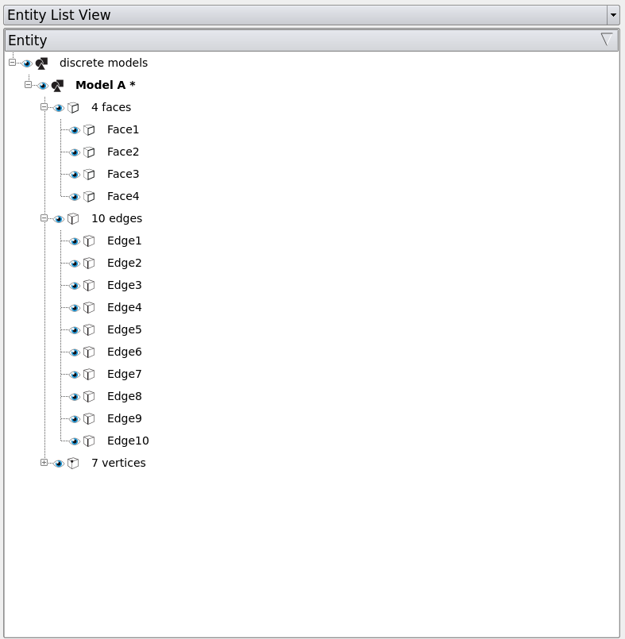
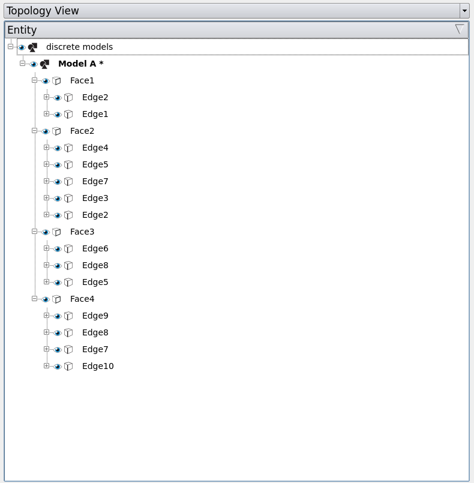

.. _model-tab:
.. index:: Model Tab

The Model Tab
=============
The Model Tab contains a hierarchical tree of models in
the scene. Multiple models can be created in one session, but a simulation
should contain only one session.

.. findfigure:: ModelTab.*

When an entity is selected, either through the entity list or the viewport, it
will be highlighted. Click the "Clear Selection" button or press Esc on the
keyboard to clear the selection.

There are two different views of the model tree - entity list view and topology
view, which can be switched in the dropdown menu. The entity list view groups
the entities based on their types, i.e., faces, edges, vertices, meshes. The
topology view, on the other hand, presents the relationships among these entities
by categorizing them as parents and children.

|EntityListView| |TopologyView|

Visibility
^^^^^^^^^^
Clicking the |pqEyeball16| symbol toggles the visibility of the corresponding
part.

Right-clicking Content
^^^^^^^^^^^^^^^^^^^^^^
Right clicking on any entity brings up a context menu with the operations can
be applied to the specific entity. The context menu varies in different sessions
as they support different operations. For example, you can create edge interactively
in the *polygon session* but not in the *discrete session*.

.. _assign-colors:

Assign Colors
^^^^^^^^^^^^^
A useful operation that is shared by all the sessions is assigning colors.
Colors can be assigned to a specific entity or multiple entities at the same
time.

Take `test2D.cmb
<https://gitlab.kitware.com/cmb/cmb-testing-data/tree/master/model/2d/cmb>`_ for
example.
Right-click on the item in the entity tree and click on "Model Entities -
Assign Colors". You can either apply a specific color to an entity, or assign a
palette to a group of entities. Here we use the default palette to color the
faces.

.. findfigure:: AssignColors.*
  :align: center
  :scale: 75%

Clear selection after you apply colors. Now every face is colored uniquely. This
is particularly useful in the complicated models where you cannot tell the entities
apart easily. You can turn off the colors by changing "Color By Entity" to others.

