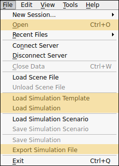

.. index:: Simulations

Loading and Saving Simulations
==============================

Simulations are files containing a template of attributes that ModelBuilder can import. ModelBuilder can edit these entries and save them for future use.

Loading a Simulation File
-------------------------

From the File dropdown in the menubar, click Open, Load Simulation Template or Load Simulation to load a simulation file. The "Open" |pqOpen32| button on the File IO toolbar can be used as well.

.. |pqOpen32| image:: images/pqOpen32.png
	:width: 24px

Saving a Simulation File
------------------------

To save a simulation file to load in the future, go to the File menu and select "Save Simulation".

.. Note::
	The save process will save both the template and the values into one file. If you are expecting to configure multiple simulations from the same template, do not overwrite the original template file.

Exporting a Simulation File
---------------------------

Once a simulation and its attributes have been finalized, you can export by going to the File menu and selecting "Export a Simulation File".

Once saved, the simulation file can then be used as an input file for external simulation software.
